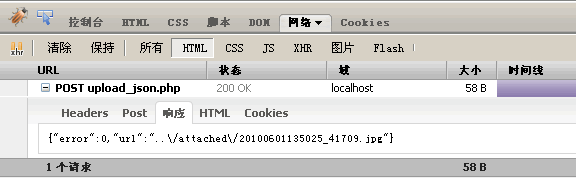

常见问题
========================================================

.. contents::
	:depth: 2

编辑器好像是UTF-8编码的，可以在GB2312页面上使用吗？
--------------------------------------------------------

可以使用。有两种方法，一种方法是引入kindeditor.js文件时将script的charset属性设置成utf-8。

还有一种方法是直接将html/js/css文件编码都转换成GB2312编码（用Notepad++、editPlus等文本编辑器就可以转换编码），不过转换格式后升级比较困难，建议使用第一种方法。

.. sourcecode:: html

	

我取不到编辑器数据，直接取得textarea的value也没用。
--------------------------------------------------------

KindEditor的可视化操作在新创建的iframe上执行，代码模式下的textarea框也是新创建的，所以最后提交前需要将HTML数据设置到原来的textarea，editor.sync()函数会完成这个动作。

KindEditor在默认情况下自动寻找textarea所属的form元素，找到form后onsubmit事件里添加editor.sync()函数，所以用form方式提交数据，不需要手动执行editor.sync()函数。

.. sourcecode:: js

	// 将编辑器的HTML数据同步到textarea
	editor.sync();

上传图片为什么出现"服务器发生故障。"？
--------------------------------------------------------

出现这个提示的根本原因是没有正确返回JSON数据。具体原因有很多，uploadJson参数设置错误，upload_json.xxx程序出错都会出现这个提示。

这时用Firefox的Firebug插件调试比较方便，上传图片后在Firebug的"网络" > "HTML"里能看到"POST upload_json.xxx"，正常情况下HTTP状态为200，并返回正确的JSON格式，如图所示。

